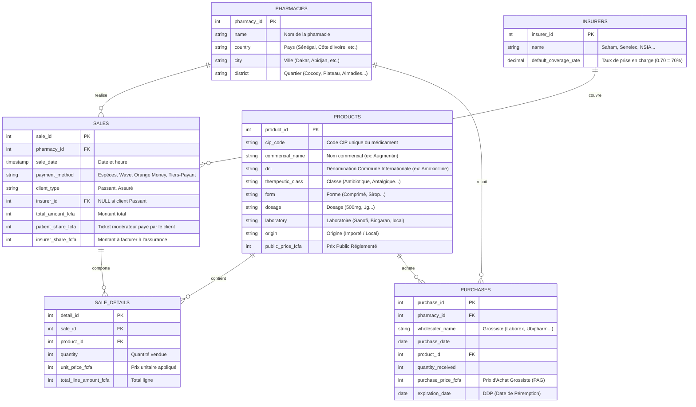

# 🌍 Exploration Business & Modèle de Données : Officines Pharmaceutiques en Afrique de l'Ouest

Ce document pose les bases conceptuelles et analytiques pour notre plateforme **GenBI** appliquée au secteur des **officines pharmaceutiques en Afrique de l'Ouest** (Sénégal, Côte d'Ivoire, Bénin, Togo, Mali, etc.).

---

## 1. Contexte Sectoriel & Spécificités d'Afrique de l'Ouest

Le marché pharmaceutique d'Afrique de l'Ouest francophone possède des règles commerciales et financières uniques :

1. **La Monnaie (Franc CFA - XOF) :**
   - Les prix des médicaments sont des **entiers stricts** (pas de centimes dans la pratique courante).
   - Exemple : *Un Doliprane 1g boîte de 8 comprimés coûte 1 150 XOF*.

2. **La Régulation des Prix :**
   - Les prix des médicaments essentiels sont réglementés par l'État (Tarif National).
   - Les pharmacies achètent aux **Grossistes Répartiteurs** (Laborex, Ubipharm, Copharm, Tedis, etc.) à un Prix d'Achat Grossiste (PAG) et revendent au Prix Public Réglementé (PPR/PPV). La marge est fixée par un coefficient légal.

3. **Le Tiers-Payant (Assurances & IPM) :**
   - Une part majeure du chiffre d'affaires d'une grande officine urbaine (Abidjan, Dakar, Cotonou) provient du **Tiers-Payant**.
   - Le patient présente sa carte d'assurance (IPM, NSIA, Saham/Sanlam, AXA, Ascoma, Mutuelle ministérielle) ; l'assurance prend en charge un pourcentage (ex: 70% ou 80%) et le patient paie le reste (**Ticket Modérateur** : 20% ou 30%).
   - L'officine doit gérer le recouvrement des factures auprès des assureurs (souvent source de tensions de trésorerie).

4. **Le Mobile Money (Paiements Numériques) :**
   - En dehors des espèces et des cartes bancaires, les paiements mobiles (**Wave, Orange Money, MTN MoMo, Moov Money**) sont très fréquents pour le règlement du ticket modérateur.

5. **La Supply Chain & Péremptions :**
   - En raison du climat chaud et des délais d'importation, le suivi des dates de péremption (**DDP**) et des ruptures de stock est crucial.

---

## 2. Dictionnaire des Acteurs Clés (Grossistes, Assureurs)

### Grossistes Répartiteurs (Fournisseurs)
- **LABOREX** (Présent au Sénégal, Côte d'Ivoire, Cameroun...)
- **UBIPHARM** (Présent dans plus de 15 pays d'Afrique de l'Ouest et Centrale)
- **COPHARMA** (Sénégal)
- **TEDIS PHARMA** (Afrique de l'Ouest)

### Assureurs & Organismes de Prévoyance
- **SAHAM / SANLAM** (Leader panafricain de l'assurance)
- **NSIA Assurances**
- **AXA / ASCOMA**
- **IPM (Institutions de Prévoyance Maladie)** : Mutuelles d'entreprises très courantes au Sénégal (ex : IPM Senelec, IPM Port Autonome).

---

## 3. Schéma Relationnel Proposé (Modèle Physique RAW)

Pour alimenter notre GenBI, nous allons simuler ou charger 6 tables principales dans le schéma `raw`.

---

## 4. Questions Métiers Typiques (Le Terrain d'Expression du GenBI)

Une fois ce modèle opérationnel, l'utilisateur final (le pharmacien titulaire, le gérant, ou l'auditeur) pourra poser des questions complexes en langage naturel :

### Questions Financières & Chiffre d'Affaires
- *"Quel est le chiffre d'affaires total de la pharmacie par mode de paiement ce mois-ci ?"*
- *"Quelle est la part du chiffre d'affaires générée par le Tiers-Payant (les assurances) ?"*
- *"Combien nous doit l'assureur Saham pour les ventes du trimestre dernier ?"*

### Questions de Gestion des Stocks & Péremptions
- *"Quels sont les produits qui vont périmer dans les 3 prochains mois et quel est leur coût d'achat ?"*
- *"Donne-moi le top 10 des médicaments les plus vendus en volume (pour éviter les ruptures)."*
- *"Quels produits n'ont enregistré aucune vente au cours des 60 derniers jours ?"*

### Questions Thérapeutiques & Laboratoires
- *"Quelle est la classe thérapeutique la plus vendue à Abidjan vs Dakar ?"*
- *"Quelle proportion de nos ventes d'antibiotiques provient de fabricants locaux (Afrique de l'Ouest) ?"*
- *"Fais-moi un récapitulatif des ventes de DCI 'Paracétamol' toutes marques confondues."*
