# 🌍 Exploration Business & Modèle de Données : Officines Pharmaceutiques en Afrique de l'Ouest

Ce document pose les bases conceptuelles et analytiques pour notre plateforme **GenBI** appliquée au secteur des **officines pharmaceutiques en Afrique de l'Ouest** (Sénégal, Côte d'Ivoire, Bénin, Togo, Mali, etc.).

---

## 1. Contexte Sectoriel & Spécificités d'Afrique de l'Ouest

Le marché pharmaceutique d'Afrique de l'Ouest francophone possède des règles commerciales et financières uniques :

1. **La Monnaie (Franc CFA - XOF) :**
   - Les prix des médicaments sont des **entiers stricts** (pas de centimes dans la pratique courante).
   - Exemple : *Un Doliprane 1g boîte de 8 comprimés coûte 1 150 XOF*.

2. **La Régulation des Prix :**
   - Les prix des médicaments essentiels sont réglementés par l'État (Tarif National).
   - Les pharmacies achètent aux **Grossistes Répartiteurs** (Laborex, Ubipharm, Copharm, Tedis, etc.) à un Prix d'Achat Grossiste (PAG) et revendent au Prix Public Réglementé (PPR/PPV). La marge est fixée par un coefficient légal.

3. **Le Tiers-Payant (Assurances & IPM) :**
   - Une part majeure du chiffre d'affaires d'une grande officine urbaine (Abidjan, Dakar, Cotonou) provient du **Tiers-Payant**.
   - Le patient présente sa carte d'assurance (IPM, NSIA, Saham/Sanlam, AXA, Ascoma, Mutuelle ministérielle) ; l'assurance prend en charge un pourcentage (ex: 70% ou 80%) et le patient paie le reste (**Ticket Modérateur** : 20% ou 30%).
   - L'officine doit gérer le recouvrement des factures auprès des assureurs (souvent source de tensions de trésorerie).

4. **Le Mobile Money (Paiements Numériques) :**
   - En dehors des espèces et des cartes bancaires, les paiements mobiles (**Wave, Orange Money, MTN MoMo, Moov Money**) sont très fréquents pour le règlement du ticket modérateur.

5. **La Supply Chain & Péremptions :**
   - En raison du climat chaud et des délais d'importation, le suivi des dates de péremption (**DDP**) et des ruptures de stock est crucial.

---

## 2. Dictionnaire des Acteurs Clés (Grossistes, Assureurs)

### Grossistes Répartiteurs (Fournisseurs)
- **LABOREX** (Présent au Sénégal, Côte d'Ivoire, Cameroun...)
- **UBIPHARM** (Présent dans plus de 15 pays d'Afrique de l'Ouest et Centrale)
- **COPHARMA** (Sénégal)
- **TEDIS PHARMA** (Afrique de l'Ouest)

### Assureurs & Organismes de Prévoyance
- **SAHAM / SANLAM** (Leader panafricain de l'assurance)
- **NSIA Assurances**
- **AXA / ASCOMA**
- **IPM (Institutions de Prévoyance Maladie)** : Mutuelles d'entreprises très courantes au Sénégal (ex : IPM Senelec, IPM Port Autonome).

---

## 3. Schéma Physique Cible : Les 10 Tables Clés d'une Officine Digitale (Niveau Expert)

Pour modéliser l'intégralité des flux financiers, logistiques et cliniques d'une officine dakaroise (les 5 piliers), nous avons besoin de **10 tables physiques** dans notre schéma `raw`. Cette structure est à la fois complète (elle couvre l'achat, le stock lot par lot, les ventes manquées, les retours pour avoir, l'inventaire physique, la facturation et les tiers-payants) et parfaitement normalisée.

```mermaid
erDiagram
    PHARMACIES ||--o{ SALES : "realise"
    PHARMACIES ||--o{ PURCHASES : "recoit"
    PHARMACIES ||--o{ MISSED_SALES : "enregistre_rupture"
    PHARMACIES ||--o{ WHOLESALER_RETURNS : "renvoie"
    CLIENTS ||--o{ SALES : "achete"
    INSURERS ||--o{ SALES : "prend_en_charge"
    PRODUCTS ||--o{ SALE_DETAILS : "est_vendu"
    PRODUCTS ||--o{ STOCKS : "a"
    PRODUCTS ||--o{ PURCHASES : "est_achete"
    PRODUCTS ||--o{ INVENTORIES : "est_controle"
    PRODUCTS ||--o{ MISSED_SALES : "fait_defaut"
    PRODUCTS ||--o{ WHOLESALER_RETURNS : "est_retourne"
    SALES ||--o{ SALE_DETAILS : "comporte"

    PHARMACIES {
        int pharmacy_id PK
        string name "Nom de la pharmacie"
        string country "Pays (Sénégal, Côte d'Ivoire...)"
        string city "Ville (Dakar, Abidjan...)"
        string district "Quartier (Almadies, Liberté 6...)"
    }

    PRODUCTS {
        int product_id PK
        string cip_code "Code CIP (ex: 3400936272545)"
        string commercial_name "Nom de marque (ex: Doliprane)"
        string dci "Dénomination Commune Internationale (ex: Paracétamol)"
        string therapeutic_class "Classe (Antalgique, Cardio...)"
        string form "Forme galénique (Comprimé, Gélule, Sirop)"
        string dosage "Dosage (1g, 500mg)"
        string laboratory "Laboratoire (Sanofi, Biogaran, local)"
        string origin "Origine (Importé / Local)"
        boolean is_generic "Indicateur si Générique (MEG)"
        boolean is_regulated "Indicateur si prix réglementé par l'État"
        decimal vat_rate "Taux de TVA appliqué (ex: 0.00 ou 0.18)"
        int public_price_fcfa "Prix Public Réglementé (PPR)"
    }

    CLIENTS {
        int client_id PK
        string first_name "Prénom"
        string last_name "Nom"
        string phone_number "Téléphone (Sénégal : +221 77...)"
        string client_type "Type (Passant, Assuré, Chronique)"
        boolean is_chronic "Indicateur Patient Chronique (Diabète/HTA)"
        int loyalty_points "Points de fidélité cumulés"
        timestamp created_at "Date d'inscription"
    }

    INSURERS {
        int insurer_id PK
        string name "Nom (IPM Senelec, Saham, AXA...)"
        decimal default_coverage_rate "Taux de prise en charge (ex: 0.80)"
    }

    STOCKS {
        int stock_id PK
        int product_id FK
        string batch_number "Numéro de Lot (Traçabilité)"
        date expiration_date "Date Limite d'Utilisation (DDP)"
        int quantity_in_stock "Quantité physique disponible"
        int safety_stock_threshold "Seuil d'alerte pour réapprovisionnement"
        string shelf_location "Emplacement physique (ex: Tiroir B3, Frigo 1)"
        timestamp last_updated_at "Date de mise à jour"
    }

    PURCHASES {
        int purchase_id PK
        int pharmacy_id FK
        string wholesaler_name "Grossiste (Laborex, Ubipharm, Tedis...)"
        date order_date "Date de commande"
        date delivery_date "Date de livraison (NULL si en cours)"
        int product_id FK
        int quantity_ordered "Quantité commandée"
        int quantity_received "Quantité livrée (Taux de service)"
        int purchase_price_fcfa "Prix d'Achat Grossiste (PAG)"
        string batch_number "Numéro de Lot reçu"
        date expiration_date "DDP du lot reçu"
    }

    SALES {
        int sale_id PK
        int pharmacy_id FK
        int client_id FK "NULL si client anonyme"
        timestamp sale_date "Date et heure exacte"
        string payment_method "Espèces, Wave, Orange Money, Tiers-Payant"
        string client_type "Passant, Assuré"
        int insurer_id FK "NULL si client hors tiers-payant"
        int total_amount_fcfa "Chiffre d'Affaires Brut"
        int patient_share_fcfa "Ticket modérateur (payé par le patient)"
        int insurer_share_fcfa "Reste à recouvrer auprès de l'assurance"
        int vat_amount_fcfa "Montant de TVA collectée (18% sur parapharmacie)"
    }

    SALE_DETAILS {
        int detail_id PK
        int sale_id FK
        int product_id FK
        int quantity "Quantité d'unités vendues"
        int unit_price_fcfa "Prix unitaire de vente appliqué"
        int total_line_amount_fcfa "Montant total de la ligne"
    }

    INVENTORIES {
        int inventory_id PK
        timestamp inventory_date "Date de l'audit physique"
        int product_id FK
        string batch_number "Lot contrôlé"
        int theoretical_quantity "Quantité théorique en base"
        int physical_quantity "Quantité réelle comptée"
        int discrepancy_quantity "Écart (Physique - Théorique)"
        string adjustment_reason "Motif de l'écart (Périmé, Cassé, Vol, Don)"
    }

    MISSED_SALES {
        int missed_sale_id PK
        int pharmacy_id FK
        int product_id FK
        timestamp missed_date "Date de la demande manquée"
        int requested_quantity "Quantité demandée par le client"
        string client_type "Type (Passant, Assuré)"
    }

    WHOLESALER_RETURNS {
        int return_id PK
        int pharmacy_id FK
        string wholesaler_name "Grossiste cible (Laborex, Ubipharm...)"
        date return_date "Date du renvoi physique"
        int product_id FK
        string batch_number "Lot renvoyé"
        int quantity_returned "Quantité de boîtes renvoyées"
        int credit_note_amount_fcfa "Montant estimé de l'avoir à recevoir (FCFA)"
        string status "Statut de l'avoir (En attente, Validé, Rejeté)"
    }
```

---

## 4. Questions Métiers Typiques (Le Terrain d'Expression du GenBI)

Une fois ce modèle opérationnel, l'utilisateur final (le pharmacien titulaire, le gérant, ou l'auditeur) pourra poser des questions complexes en langage naturel :

### Questions Financières & Chiffre d'Affaires
- *"Quel est le chiffre d'affaires total de la pharmacie par mode de paiement ce mois-ci ?"*
- *"Quelle est la part du chiffre d'affaires générée par le Tiers-Payant (les assurances) ?"*
- *"Combien nous doit l'assureur Saham pour les ventes du trimestre dernier ?"*

### Questions de Gestion des Stocks & Péremptions
- *"Quels sont les produits qui vont périmer dans les 3 prochains mois et quel est leur coût d'achat ?"*
- *"Donne-moi le top 10 des médicaments les plus vendus en volume (pour éviter les ruptures)."*
- *"Quels produits n'ont enregistré aucune vente au cours des 60 derniers jours ?"*

### Questions Thérapeutiques & Laboratoires
- *"Quelle est la classe thérapeutique la plus vendue à Abidjan vs Dakar ?"*
- *"Quelle proportion de nos ventes d'antibiotiques provient de fabricants locaux (Afrique de l'Ouest) ?"*
- *"Fais-moi un récapitulatif des ventes de DCI 'Paracétamol' toutes marques confondues."*

---

## 5. Zoom Opérationnel : Les 5 Piliers d'une Officine à Dakar

Pour une officine de taille moyenne à grande située à Dakar (ex: sur l'Avenue Bourguiba, à Liberté 6 ou aux Almadies), le système d'information repose sur 5 piliers opérationnels interconnectés que notre GenBI doit pouvoir analyser.

### 📊 Pilier 1 : L'Approvisionnement (Procurement)
À Dakar, l'approvisionnement est un flux tendu quotidien.
- **Les Fournisseurs :** Principalement les grossistes locaux. **Laborex** (situé à Hann) et **Ubipharm** livrent plusieurs fois par jour (ex: commande passée à 9h, livrée à 14h).
- **Le Défi des Ruptures :** Le GenBI doit permettre de calculer le **Taux de Service Grossiste** (le ratio entre les boîtes commandées et les boîtes réellement livrées). Si Ubipharm a un taux de service de 95% sur les antibiotiques et Laborex de 88%, l'officine réajustera ses priorités d'achat.
- **Les Remises :** Suivi des remises commerciales négociées sur les volumes d'achat (remises de fin d'année - RFA).

### 📦 Pilier 2 : Le Stock (Stock Management)
Le stock d'une officine dakaroise représente des dizaines de millions de FCFA immobilisés.
- **Double Valorisation :** Le stock doit être valorisé en temps réel :
  1. Au **Prix d'Achat Grossiste (PAG)** : pour la comptabilité et le bilan.
  2. Au **Prix Public Réglementé (PPR)** : pour évaluer la valeur de vente potentielle.
- **Alerte Péremption (DDP) :** La chaleur à Dakar exige un suivi strict. Le GenBI doit pouvoir répondre à : *"Quel est le stock dormant qui périme dans moins de 180 jours ?"* afin de permettre des retours grossistes ou des promotions sur la parapharmacie.
- **Chaîne du Froid :** Suivi spécifique des produits réfrigérés (Insulines, vaccins) qui nécessitent des réfrigérateurs avec onduleurs/générateurs en cas de délestages de la Senelec.

### 📝 Pilier 3 : L'Inventaire (Inventory)
C'est l'outil de contrôle de l'officine pour mesurer la rentabilité réelle.
- **Écarts d'Inventaire :** Différence entre le stock théorique (logiciel) et le stock physique (compté).
- **Démarque Inconnue :** Le GenBI doit traquer la démarque inconnue (vols en rayon, produits cassés, pertes thermiques, ou oublis de facturation).
- **Inventaires Tournants :** Au lieu de fermer l'officine, les auxiliaires font des inventaires tournants par rayonnage (ex: étagère "Pédiatrie" le lundi, étagère "Cardiologie" le mardi).

### 🛒 Pilier 4 : La Vente (Sales & Dispensing)
La vente à Dakar reflète la mixité sociale et économique de la ville.
- **Typologie des Ventes :**
  - **Vente Libre (OTC / Comptoir) :** Clients passants achetant de la parapharmacie ou de l'automédication en espèces ou Mobile Money.
  - **Vente sur Ordonnance :** Souvent liée au Tiers-Payant.
- **La Révolution Mobile Money :** À Dakar, l'intégration de **Wave** (reconnaissable à ses QR codes bleus à chaque caisse) et **Orange Money** est indispensable. Les frais Wave (1%) sont bien inférieurs aux cartes bancaires (2.5% à 3.5%), ce qui en fait le mode de paiement digital privilégié.
- **Les IPM & Assurances :** L'officine dakaroise travaille avec des dizaines d'**IPM (Institutions de Prévoyance Maladie)** d'entreprises publiques et privées (IPM Senelec, IPM Port Autonome de Dakar, IPM Sonatel, IPM Douanes). Le suivi du taux de sinistralité et des délais de remboursement de ces IPM est vital pour la trésorerie.

### 👤 Pilier 5 : Les Clients (Patients & Fidélisation)
- **Suivi des Pathologies Chroniques :** Dakar connaît une prévalence importante de maladies chroniques (Diabète, Hypertension Artérielle - HTA). Une bonne officine fidélise ces patients en suivant leurs renouvellements mensuels.
- **Le Dossier Patient :** Regroupe les consommations de la famille (ex: le père, la mère et les enfants rattachés à la même IPM).
- **Le Ticket Modérateur :** Analyser si le patient paie son ticket modérateur directement (espèces/Wave) ou s'il bénéficie d'une prise en charge à 100% (cas de certaines mutuelles de cadres).

---

## 6. Approfondissement Stratégique & Analytique à 360 Degrés (Niveau Expert)

En poussant l'analyse au plus haut niveau de maturité décisionnelle, l'officine n'est plus seulement un commerce de proximité, mais une entreprise logistique, financière et de santé publique. Voici la modélisation à 360° des défis analytiques majeurs :

### 💳 1. Le BFR et les Encours IPM (Days Sales Outstanding - DSO)
Le besoin en fonds de roulement (BFR) d'une pharmacie à Dakar est directement impacté par les délais de paiement des IPM. 
- **La problématique :** L'IPM Senelec ou Douanes peut accumuler 60 à 90 jours de retard pour rembourser sa part de Tiers-Payant. Si l'officine doit payer ses grossistes à 30 jours, elle fait face à une crise de trésorerie (le "trou" du Tiers-Payant).
- **Modélisation analytique :** Le GenBI calcule le DSO par assureur : 
  $$\text{DSO} = \frac{\text{Encours assurance}}{\text{Ventes mensuelles Tiers-Payant}} \times 30$$
- **Question IA :** *"Quels assureurs ont un délai moyen de remboursement supérieur à 45 jours et quel est le montant total de notre encours actuel chez eux ?"*

### 💊 2. La Substitution Générique et l'Optimisation de Marge
- **La problématique :** Face aux ruptures de stocks régulières et pour réduire le reste à charge du patient, le pharmacien remplace un médicament de marque (Princeps, ex: *Clamoxyl*) par son générique équivalent (MEG, ex: *Amoxicilline Biogaran*).
- **Modélisation analytique :** Le champ `is_generic` dans `raw.products` permet de calculer le **Taux de Substitution**. Les médicaments génériques ont généralement des coefficients de marge réglementés légèrement plus favorables en pourcentage pour l'officine, tout en étant moins coûteux pour les clients (et moins consommateurs d'encours de remboursement pour les mutuelles).
- **Question IA :** *"Calcule notre taux de substitution générique par classe thérapeutique ce mois-ci et estime la marge additionnelle dégagée grâce à cette substitution."*

### 📉 3. Le Manque à Gagner des Ventes Manquées (Missed Sales)
- **La problématique :** Lorsqu'un client demande un médicament en rupture (ex: *Lovenox*) et s'en va, le système informatique de vente classique n'enregistre rien car aucune transaction n'a eu lieu. C'est une perte invisible de chiffre d'affaires et de fidélité.
- **Modélisation analytique :** La table `raw.missed_sales` enregistre chaque demande insatisfaite. Le GenBI peut croiser ces données avec le catalogue de prix pour quantifier le **Coût d'opportunité des ruptures**.
- **Question IA :** *"Quel est le montant total estimé du manque à gagner dû aux ruptures de stock ce mois-ci, et quels sont les 5 produits les plus demandés qui étaient absents ?"*

### 📦 4. La Gestion Active des Retours pour Avoirs Grossistes
- **La problématique :** Les grossistes (Laborex, Ubipharm...) acceptent de reprendre les médicaments non vendus jusqu'à 3 ou 6 mois avant leur date limite d'utilisation (DDP) pour émettre un avoir. Si la pharmacie dépasse ce délai, le produit doit être détruit (perte de 100% de la valeur d'achat).
- **Modélisation analytique :** La table `raw.wholesaler_returns` croisée avec `raw.stocks` permet de mettre en place des alertes prédictives. Le GenBI peut lister les produits à renvoyer immédiatement aux grossistes pour sécuriser les avoirs financiers.
- **Question IA :** *"Quels lots en stock atteignent leur fenêtre de retour grossiste de 4 mois ce mois-ci et quelle est la valeur totale des avoirs que nous pouvons récupérer ?"*

### 🧾 5. La Fiscalité Régionale (TVA UEMOA 18%)
- **La problématique :** Au Sénégal, les médicaments prescrits et inscrits au Tarif National sont exonérés de TVA (TVA 0%). En revanche, les produits de parapharmacie (cosmétiques, laits infantiles, brosses à dents) sont assujettis à la TVA standard de 18%.
- **Modélisation analytique :** Le champ `vat_rate` dans `raw.products` et `vat_amount_fcfa` dans `raw.sales` permettent une ventilation fiscale automatique et transparente pour les déclarations de TVA mensuelles.
- **Question IA :** *"Donne-moi le montant de la TVA collectée sur la parapharmacie par semaine pour notre déclaration fiscale et le ratio CA Médicament vs CA Parapharmacie."*

### 🩺 6. L'Observance Thérapeutique Clinique (CRM Prédictif)
- **La problématique :** Dans le cas des maladies chroniques (Diabète, HTA) à Dakar, le renouvellement régulier de l'ordonnance est synonyme d'observance du traitement par le patient (enjeu de santé publique) et de récurrence commerciale stable pour l'officine.
- **Modélisation analytique :** Grâce au champ `is_chronic` de `raw.clients` et au suivi des ventes nominatives dans `raw.sales`, le GenBI peut détecter les patients "hors observance" (ceux dont la durée théorique du traitement est dépassée mais qui ne sont pas revenus acheter leur renouvellement).
- **Question IA :** *"Identifie tous les patients chroniques hypertendus qui auraient dû renouveler leur ordonnance il y a plus de 5 jours et sors la liste de leurs numéros de téléphone pour un suivi de courtoisie."*

